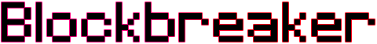
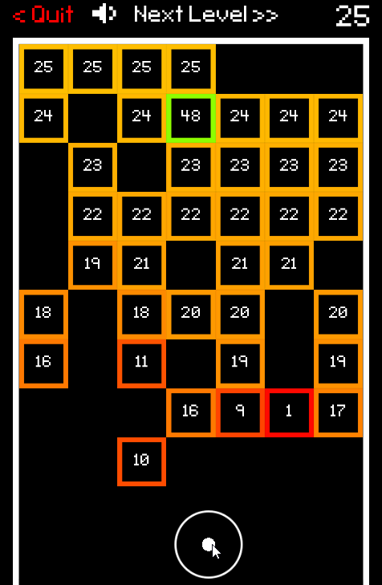
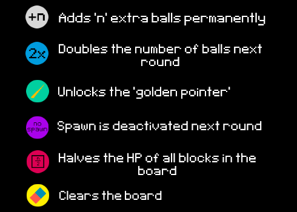

An arcarde shooter game made with Unity (c#). Play online [here](https://nuno-faria.itch.io/blockbreaker).

## About

Try to reach the highest level possible. The game is over when a block reaches the end. Each level, new blocks appear at the top and a new ball is added to the arsenal. Each block has a number representing its health. 

### Pickups

### Controls

- Mouse